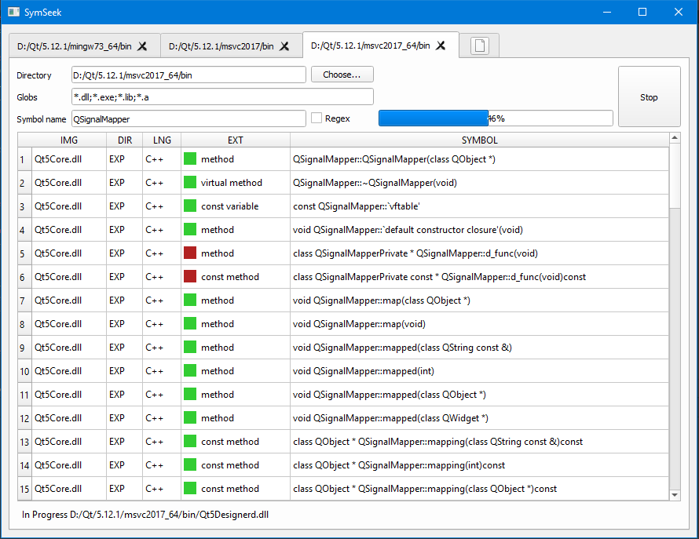

# SymSeek
Desktop application for searching symbols within binaries

## Purpose
When dealing with a large set of binaries in a product, including the 3rd party libs, we often need to know which libs contain particular symbols and which libs use them. Sometimes it can take long to find it out. This tool is aimed to automate this process.

## Features
- Searching names within binaries filtered by globs
- COFF files support (\*.exe and \*.dll). \*.lib files are not supported yet.
- ELF files support (\*.so). Not implemented yet.
- Mach-O files support (\*.dylib). Not implemented yet.

## Issues
The most difficult part I faced with was name demangling. At the moment, the toolchain specific facilities demangle the names. Ideally this function should not be bound to the toolchain internals to be able to search symbols in binaries of the other platforms.
Also I'm going to make the search process smarter and more open to user's customization.

## Build
Currently SymSeek needs CMake and Qt5 framework dev package installed.

`cd SymSeek && mkdir build && cd build && cmake .. && cmake --build .`

If cmake cannot find Qt, you can point out its location via "-DCMAKE_PREFIX_PATH=<PATH_TO_YOUR_QT_ROOT>" argument. On my Windows PC it is `D:\Qt\5.12.1\mingw73_64`.

